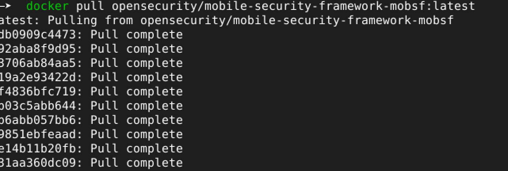
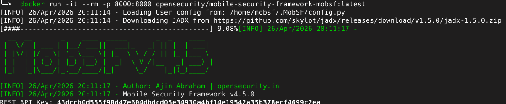
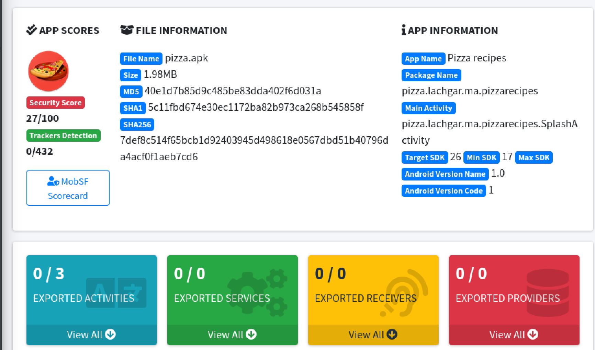

# 🔐 LAB 6 — Analyse Statique d'une Application Android avec MobSF

## 📋 Contexte du laboratoire

Dans le cadre de ce laboratoire de sécurité mobile, j'ai réalisé une analyse statique complète d'une application Android (`pizza.apk`) en utilisant l'outil **MobSF (Mobile Security Framework)**. L'objectif principal est d'identifier les failles de sécurité présentes dans l'APK sans exécuter l'application, en s'appuyant uniquement sur l'inspection du code, du manifeste et de la configuration de signature.

---

## 🗂️ Informations de l'analyse

| Champ              | Détail                                                                 |
|--------------------|------------------------------------------------------------------------|
| **Date**           | 26 avril 2026                                                          |
| **Analyste**       | Niama                                                                    |
| **APK cible**      | `pizza.apk`                                                            |
| **SHA-256**        | `7def8c514f65bcb1d92403945d498618e0567dbd51b40796da4acf0f1aeb7cd6`   |
| **Version app**    | 1.0                                                                    |
| **Outil utilisé**  | MobSF v4.5.0 (déployé via Docker)                                      |

---

## 🚀 Mise en place de l'environnement

### Étape 1 — Téléchargement de l'image Docker MobSF

Pour éviter toute installation locale complexe, j'ai utilisé Docker pour déployer MobSF rapidement dans un conteneur isolé. La commande suivante récupère l'image officielle depuis Docker Hub :

```bash
docker pull opensecurity/mobile-security-framework-mobsf:latest
```

> Cette approche garantit un environnement reproductible et propre pour chaque session d'analyse.



### Étape 2 — Lancement du conteneur et génération de la clé API

Une fois l'image récupérée, le conteneur est démarré en exposant MobSF sur le port `8000` :

```bash
docker run -it --rm -p 8000:8000 opensecurity/mobile-security-framework-mobsf:latest
```

Au démarrage, MobSF génère automatiquement une **clé API REST** permettant d'interagir avec l'outil de façon programmatique (utile pour l'automatisation CI/CD).



---

## 📊 Résultats de l'analyse — Vue d'ensemble

Après soumission de `pizza.apk` sur l'interface MobSF (`http://localhost:8000`), le tableau de bord affiche un bilan de sécurité alarmant :

- **Score de sécurité :** `27 / 100`
- **Note globale :** `F`
- **Niveau de risque :** 🔴 **CRITICAL RISK**



Ce résultat indique que l'application souffre de défauts fondamentaux de configuration et de signature, la rendant **inapte à une distribution en production**.

---

## 🛑 Vulnérabilités identifiées

### 1. Signature avec un certificat de débogage

| Attribut       | Valeur                                      |
|----------------|---------------------------------------------|
| **Sévérité**   | 🔴 Élevée (High)                            |
| **Référence**  | MASVS : MSTG-CODE-1                         |

**Observation :** L'APK est signé avec le certificat de débogage par défaut d'Android, identifié par :
```
CN=Android Debug, O=Android, C=US
```

Ce certificat est public, non sécurisé et partagé entre tous les environnements de développement Android. Son usage en production signifie que n'importe qui disposant des outils adéquats pourrait potentiellement re-signer l'application.

**Correction recommandée :** Générer un keystore de production sécurisé et signer l'APK avec avant toute publication :
```bash
keytool -genkey -v -keystore my-release-key.jks -keyalg RSA -keysize 2048 -validity 10000 -alias my-key-alias
```

---

### 2. Algorithme de hachage obsolète (SHA-1)

| Attribut       | Valeur                                      |
|----------------|---------------------------------------------|
| **Sévérité**   | 🔴 Élevée (High)                            |
| **Référence**  | MASVS : MSTG-CRYPTO-1                       |

**Observation :** La signature utilise `SHA-1`, un algorithme cryptographiquement compromis depuis 2017 (attaque SHAttered par Google/CWI). Cela fragilise l'intégrité de la signature.

**Correction recommandée :** Migrer vers **SHA-256** ou supérieur en utilisant le schéma de signature v2/v3 d'Android.

---

### 3. Compatibilité avec des versions Android obsolètes (`minSdkVersion=17`)

| Attribut       | Valeur                                      |
|----------------|---------------------------------------------|
| **Sévérité**   | 🔴 Élevée (High)                            |
| **Référence**  | MASVS : MSTG-PLATFORM-1                     |

**Observation :** Avec `minSdkVersion=17` (Android 4.2), l'application peut s'installer sur des systèmes anciens qui ne reçoivent plus aucune mise à jour de sécurité depuis des années.

**Correction recommandée :** Relever le `minSdkVersion` à **29 (Android 10)** dans le fichier `build.gradle` :
```groovy
android {
    defaultConfig {
        minSdkVersion 29
    }
}
```

---

### 4. Mode débogage activé en production (`android:debuggable=true`)

| Attribut       | Valeur                                      |
|----------------|---------------------------------------------|
| **Sévérité**   | 🔴 Élevée (High)                            |
| **Référence**  | MASVS : MSTG-RESILIENCE-2                   |

**Observation :** Le flag `android:debuggable="true"` est présent dans le `AndroidManifest.xml` et confirmé dans `BuildConfig.java`. Un attaquant peut se connecter au processus via `adb`, inspecter la mémoire, extraire des données sensibles ou manipuler le flux d'exécution.

**Correction recommandée :** S'assurer que ce flag est absent ou `false` pour les builds de release. Utiliser les variantes de build Gradle pour automatiser cela :
```groovy
buildTypes {
    release {
        debuggable false
        minifyEnabled true
    }
}
```

---

## ⚠️ Observations complémentaires

### Vulnérabilité Janus (CVE-2017-13156)

L'application utilise uniquement les schémas de signature **v1 et v2**, la rendant potentiellement vulnérable à la faille Janus sur les appareils Android antérieurs à la version 8.0. Cette faille permet à un attaquant d'injecter du code malveillant dans l'APK sans invalider la signature.

**Correction :** Adopter le schéma de signature **v3** ou **v4** qui inclut des protections supplémentaires.

### Sauvegarde ADB non restreinte (`android:allowBackup=true`)

Le flag `allowBackup` autorise la copie complète des données de l'application via `adb backup`, même sans root. Si l'application gère des données sensibles (tokens, identifiants, historique), cela constitue un risque de fuite de données.

**Correction :** Désactiver la sauvegarde non chiffrée dans le manifeste :
```xml
<application
    android:allowBackup="false"
    ... >
```

---

## ✅ Plan de remédiation priorisé

| Priorité | Action corrective                                  | Effort estimé |
|----------|----------------------------------------------------|---------------|
| 🔴 P1    | Re-signer avec un certificat de production (SHA-256) | Faible       |
| 🔴 P1    | Désactiver `android:debuggable` en release          | Faible        |
| 🟠 P2    | Relever `minSdkVersion` à 29                        | Moyen         |
| 🟠 P2    | Adopter le schéma de signature v3/v4                | Faible        |
| 🟡 P3    | Désactiver `android:allowBackup`                    | Faible        |

---

## 📁 Annexes techniques

- **Permissions dangereuses détectées :** 0 sur les 25 permissions typiquement associées aux malwares — l'application ne demande pas de permissions sensibles.
- **Composants Android :** 3 Activités recensées, aucune exportée (surface d'attaque inter-application nulle).
- **Rapport complet MobSF :** [`pizza_mobsf_rapport.pdf`](pizza_mobsf_rapport.pdf)

---

> **Note :** Cette analyse est réalisée dans un cadre académique. Toutes les conclusions sont basées sur une inspection statique uniquement (sans exécution de l'application). Une analyse dynamique complémentaire permettrait de confirmer l'exploitabilité réelle de ces vulnérabilités.